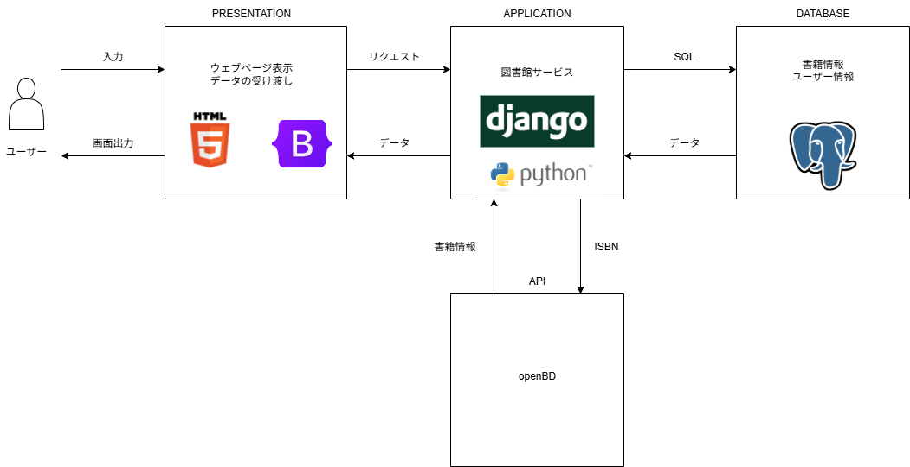

# Library
# 社内図書館アプリ

## 使用技術一覧
Python  
Django  
HTML  
CSS  
Bootstrap

## 概要
このアプリは図書館のように社内で保有するすべての書籍を管理することを目的としている。利用者である従業員はこのアプリを用いて本を検索して借りたり、予約したり、返却したりできる。また、従業員のなかでも管理者によって図書館職員の権限を得た人は本をデータベースに追加したり、本をデータベースから削除したりできる。

## システム構成


## ER


## 環境
Language  
Python 3.13.2

```
Package            Version
------------------ ---------
APScheduler        3.11.0
asgiref            3.8.1
certifi            2025.6.15
charset-normalizer 3.4.2
Django             5.2.2
django-apscheduler 0.7.0
idna               3.10
pip                25.1.1
psycopg            3.2.9
psycopg-binary     3.2.9
requests           2.32.4
sqlparse           0.5.3
tzdata             2025.2
tzlocal            5.3.1
urllib3            2.4.0
```

## アプリのディレクトリ
次のコマンドで表示する。
> tree

```
├─accounts
│  ├─migrations
│  │  └─__pycache__
│  ├─templates
│  │  └─accounts
│  └─__pycache__
├─library
│  └─__pycache__
├─registration_book
│  ├─migrations
│  │  └─__pycache__
│  ├─templates
│  │  └─registration_book
│  └─__pycache__
├─rental
│  ├─management
│  │  └─commands
│  │      └─__pycache__
│  ├─migrations
│  │  └─__pycache__
│  ├─templates
│  │  └─rental
│  ├─templatetags
│  │  └─__pycache__
│  └─__pycache__
└─templates
```

## 使用方法
同じレポジトリ内にある[操作マニュアル](図書館アプリの操作マニュアル.pdf)にアプリの使用方法が記載されている。

## ライセンス
MIT License

## コンタクト
作成者：工藤聡汰